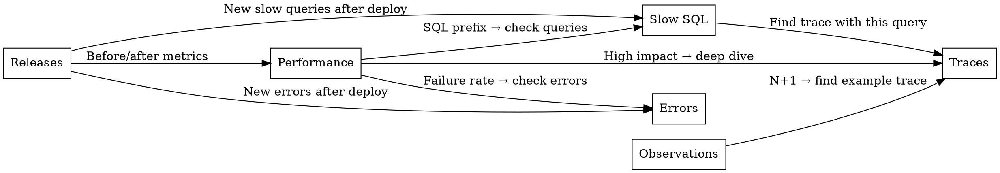

# Root-Cause Analysis Framework

## Hypothesis Generation Protocol

When analyzing Tideways data, generate hypotheses systematically — not by guessing, but by following evidence chains.

### Evidence Chain

```
Observable metric → Technical mechanism → Code-level cause → Architectural reason
```

**Example:**
```
p95 response time 8.2s on ProductList\Controller\Index
  → 28% Impact, SQL prefix, 320 requests in last hour
    → ORM query loading full entity with all columns, 2400 slow SQL occurrences
      → Listing page loads full records instead of only needed fields
        → No field selection on query; ORM defaults to SELECT *
```

Every hypothesis MUST have:
1. **Observable data** - what you see in Tideways (with specific numbers)
2. **Mechanism** - how the code produces this behavior
3. **Root cause** - why the code is written this way
4. **Confidence level** - based on evidence strength
5. **Verification steps** - how to confirm the hypothesis
6. **Fix** - concrete action

## Confidence Scoring

| Level | Definition | When to assign |
|-------|-----------|---------------|
| **HIGH** | Direct evidence in trace/metrics, reproducible | Slow SQL with exact query + stacktrace pointing to specific code |
| **MEDIUM** | Pattern match + indirect signals, likely correct | Transaction with SQL prefix + known ORM anti-pattern in framework module |
| **LOW** | Experience-based hypothesis, needs verification | "Probably caching issue" based on response time variance |

**Rules:**
- Never state LOW confidence findings as facts
- Always present HIGH confidence findings first
- For MEDIUM, state what additional data would make it HIGH
- For LOW, state what investigation steps are needed

## Deploy Regression Analysis

### When to investigate:
- Response time increase >20% after release
- New errors appearing within 24h of deploy
- New transactions appearing in transaction list
- Failure rate increase >0.1%

### Stack-Diff Method

Compare traces of the same transaction before and after deploy:

1. Navigate to History, find the release
2. Open a trace from BEFORE the release
3. Open a trace from AFTER the release
4. Compare:

| What to compare | Signal |
|----------------|--------|
| Call depth increased | New middleware, hook, or decorator added |
| New function calls in stack | New event listener, new module code |
| SQL query count increased | New data loading, new query |
| Memory increase | New object creation, larger data sets |
| New external HTTP calls | New integration, new API call |

### Impact Scoring for Regressions

```
Impact Score = (Response time increase %) × (Request volume) × (User-facing weight)

User-facing weights:
  - Checkout: 3.0 (revenue-critical)
  - Product page: 2.0 (conversion-critical)
  - Category page: 1.5 (discovery)
  - AJAX/API: 1.0 (background)
  - Admin: 0.5 (internal only)
  - Cron: 0.3 (background job)
```

### Regression Report Format

```markdown
## Deploy Regression: [Release identifier]

**Deployed:** [timestamp]
**Detected:** [how long after deploy]
**Severity:** CRITICAL / HIGH / MEDIUM / LOW

### What changed
[Specific metrics before vs after]

### Root cause
[Technical explanation with evidence]

### Affected transactions
| Transaction | Before | After | Change |
|-------------|--------|-------|--------|
| ... | ... | ... | +X% |

### Recommended action
[Concrete fix or rollback criteria]
```

## Architectural Assessment

Beyond micro-optimizations, assess the architecture:

### Is this IO-bound or CPU-bound?

**IO-bound indicators:**
- Wall time >> CPU time (ratio >3:1)
- SQL prefix or HTTP prefix dominant
- Response time increases with concurrent requests
- Adding more CPU doesn't help

**CPU-bound indicators:**
- Wall time ≈ CPU time
- COMPILE prefix or no prefix
- Complex calculations, serialization, rendering
- Response time constant regardless of concurrency

**Why it matters:**
- IO-bound: optimize queries, add caching, use async patterns
- CPU-bound: optimize code, consider OPcache, evaluate algorithm complexity

### Horizontal vs Vertical Scaling Assessment

| Signal | Scaling recommendation |
|--------|----------------------|
| All workers busy, requests queuing | More workers (horizontal) |
| Single request uses all CPU | Faster CPU (vertical) |
| Database queries slow | Database optimization or read replicas |
| Memory per request >50% of worker limit | Memory optimization or larger instances |
| External API calls dominate | Queue-based processing, not more servers |
| Session locking between requests | Architecture change (not scaling) |

### Infrastructure-Level Assessment

**MySQL is the bottleneck when:**
- SQL prefix on majority of transactions
- Slow SQL count growing
- Query times increase during traffic peaks
- `SHOW PROCESSLIST` shows many sleeping connections

**Redis is the bottleneck when:**
- Session/cache operations >10ms per call
- Cache eviction happening (memory full)
- Connection count near limit
- Pipeline not being used for batch operations

**PHP-FPM is the bottleneck when:**
- All workers busy (check `pm.status`)
- Request queuing happening
- Memory limit per worker too low (OOM kills)
- `pm.max_children` too low for traffic

**OPcache is the bottleneck when:**
- COMPILE prefix on all transactions
- `opcache_get_status()` shows high restarts
- `max_accelerated_files` < actual file count
- `validate_timestamps=1` in production

## Cross-Reference Analysis

### Correlating across Tideways sections



### Correlation Matrix

| If you see... | Also check... | Because... |
|---------------|---------------|-----------|
| SQL prefix on listing page | Slow SQLs for ORM queries | Listing pages typically trigger heavy queries |
| COMPILE prefix everywhere | Observations for autoloading/compiling | Likely OPcache issue |
| SESSION prefix on AJAX | Other AJAX transactions | Session locking affects all concurrent requests |
| High memory on detail page | Data loading in trace | Probably loading full entity with all relations |
| New errors after deploy | Release page for timing | Deploy may have introduced regression |
| Low cache hit rate | Performance overview requests count | More requests = more misses if TTL wrong |
| N+1 observation | Slow SQLs page | N+1 generates many slow queries |

## Predictive Analysis

Based on current data, project future issues:

### Growth Projection
```
If current query takes 1s with 10k products:
  At 30k products (assuming linear scaling): ~3s
  At 100k products: ~10s

  BUT: If query is O(n²) (e.g., cross-join):
  At 30k products: ~9s
  At 100k products: ~100s
```

**When to flag:**
- "At current growth rate, this query will exceed 5s threshold within [X weeks]"
- "Current traffic is 58 RPM. At 2x traffic, FPM worker pool (current: N) will be saturated"

### Capacity Planning Signals
| Current metric | Warning threshold | Action needed |
|---------------|-------------------|---------------|
| FPM workers at >70% utilization | >80% | Increase pm.max_children or add server |
| Memory per request >200MB | >256MB | Investigate memory usage, optimize collections |
| Slow SQL occurrences growing >10%/week | Sustained growth | Query optimization needed before it compounds |
| p95 response time >5s | >8s | Performance optimization sprint needed |
| Cache hit rate dropping >5%/week | Below 70% | Cache configuration review |

## Output Quality Checklist

Before presenting any analysis, verify:

- [ ] Every finding has specific numbers from Tideways (not vague descriptions)
- [ ] Root cause explains WHY, not just WHAT
- [ ] Fix is concrete enough to implement without further research
- [ ] Confidence level is honest (don't inflate to seem more useful)
- [ ] No sensitive data (actual URLs, user data, credentials) in output
- [ ] Sampling caveats stated for low-volume transactions
- [ ] Incomplete trace data acknowledged where applicable
- [ ] Impact estimate provided (time savings, not just "improvement")
- [ ] Priority justified by effort-vs-impact, not just severity
